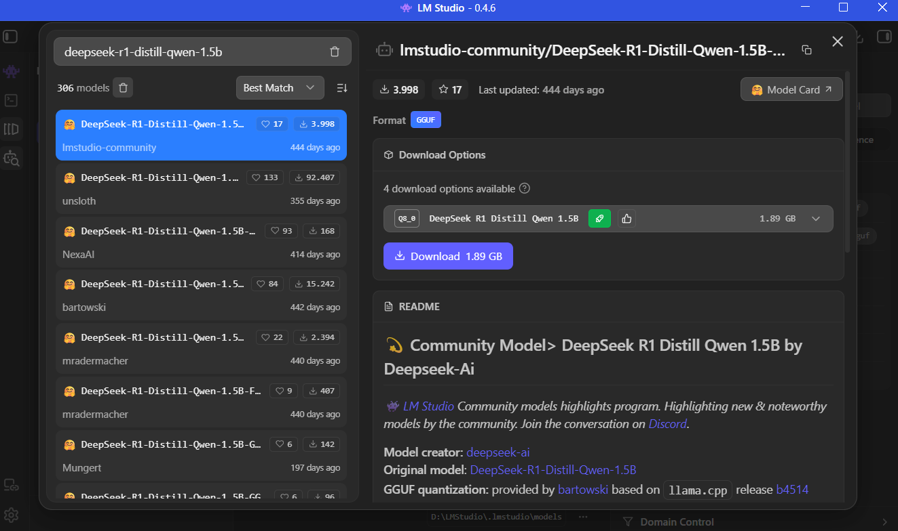
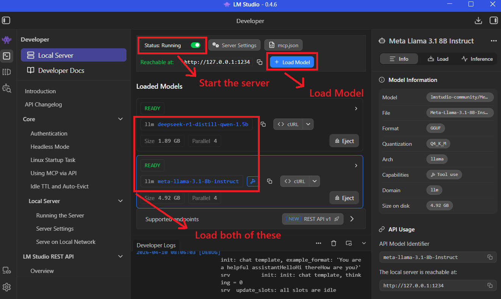

# SLM-RAG-ASSISTANT

This project implements a Small Language Model interface that uses RAG (Retrieval Augmented Generation) to extract data from a ChromaDB database based on context. 

---

## 💻 Setup

This project was created using `Python 3.12.6` and a list of libraries disclosed within `requirements.txt`. The small-language-models used were downloaded and hosted locally using `LMStudio`. The following steps are necessary to execute this project:

1. **Install LMStudio**

    [LMStudio](https://lmstudio.ai/) is a free tool for running small to large language models locally, allowing the prompting to be done through a built-in interface or through user-defined endpoints.

2. **Download the Small Language Models**

    From within the LMStudio interface, download the following models:
    - `meta-llama-3.1-8b-instruct`
    - `deepseek-r1-distill-qwen-1.5b`

    Alternatively, for a broader language support, you can use these models:
    - `google/gemma-4-e2b`
    - `google/gemma-4-e4b`

    The following image illustrates the download procedure:
    

3. **Install required libraries**

    This project uses several libraries, ranging from `openai` for endpoint communication to `chromadb` for context window management.
    Open the terminal within the project folder and execute the following command:
    ```
        pip install -r requirements.txt 
    ```
    This will install all necessary dependencies explicitly stated within the requirements file.
    These are the required libraries:
    ```
        chromadb>=0.5.23
        sentence-transformers>=3.2.1
        pymupdf>=1.27.2.2
        langchain_text_splitters>=1.1.1
        openai>=2.24.0
        pillow>=11.2.1
    ```
4. **Initiate the local hosting of a language model**
    For the model usage, you must load the necessary models and start the server. The application's interface makes this task simple. Please refer to the following image:
    

5. **Interface initialization and usage**
    To execute the project, you must ensure you have Python at version `3.12.6` or above, then simply execute the `assistant.py` script, which initiates a TKinter window. 
    Inside the running instance, the user is able to select documents from the desktop, change the model's language and perform a question, which will be answered by the model based on the contents found within the source files. 
    The first initialization may take a while.
    **IMPORTANT: the LMStudio server MUST be running with both models loaded and active.**

6. **Perform a headless prompt**
    You can also perform a headless prompt by running the following command inside the terminal (while accessing the project folder): 

    ```python prompt_assistant.py -f [list_of_file_paths] -q "question"```