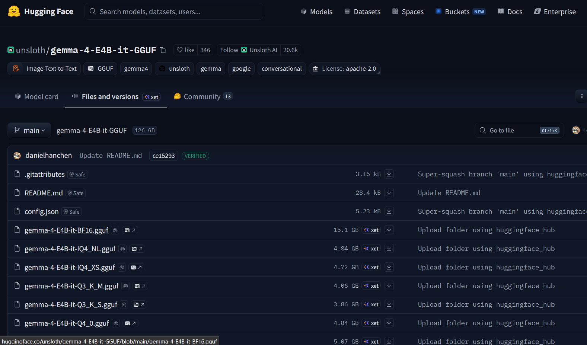
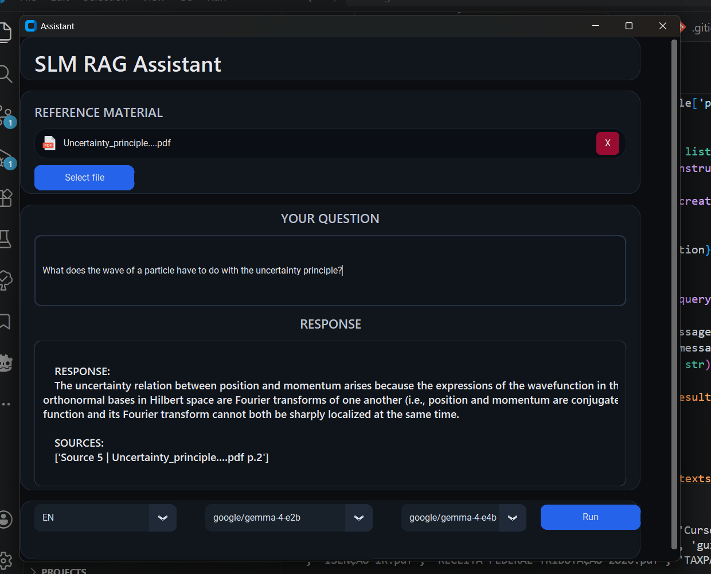
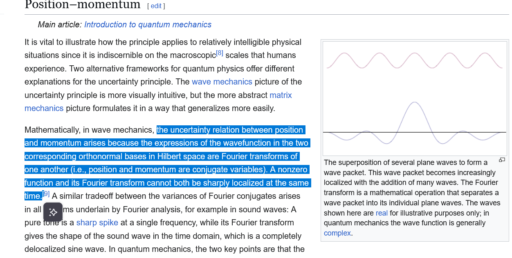
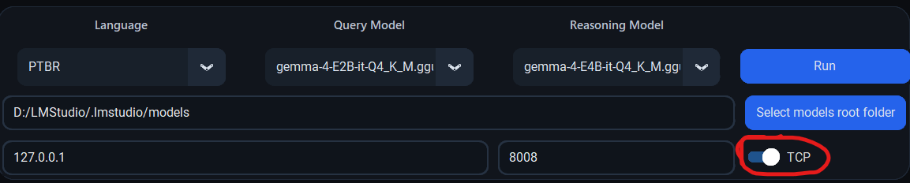

# SLM-RAG-ASSISTANT

This project implements a Small Language Model interface that uses RAG (Retrieval Augmented Generation) to extract data from a ChromaDB database based on context. 

---

## 💻 Setup

This project was created using `Python 3.12.6` and a list of libraries disclosed within `requirements.txt`. The small-language-models used were downloaded from `huggingface.co` and hosted locally using the `LLama` library. The following steps are necessary to execute this project:

1. **Visit Huggingface.co**

    [HuggingFace](https://huggingface.co/models) is an online community that allows the download of Large Language Models, as `.GGUF` files, used for local hosting. **IMPORTANT:** You must download the GGUF files as they are quantized vesions of the model, with higher efficiency and lower hardware requirement.

2. **Download the Small Language Models**

    **IMPORTANT: Download the files that contain tags such as 'Q4_K' in the name, which stand for quantization level. Quantized models are lighter and faster.**
    
    From within the HuggingFace interface, download the following models:
    - [meta-llama-3.1-8b-instruct](https://huggingface.co/meta-llama/Llama-3.1-8B-Instruct)
    - [deepseek-r1-distill-qwen-1.5b](https://huggingface.co/deepseek-ai/DeepSeek-R1-Distill-Qwen-1.5B)

    Alternatively, for a broader language support, you can use these models:
    - [google/gemma-4-e2b](https://huggingface.co/unsloth/gemma-4-E2B-it-GGUF/tree/main)
    - [google/gemma-4-e4b](https://huggingface.co/unsloth/gemma-4-E4B-it-GGUF/tree/main)

    The following image illustrates the download procedure:
    

    After downloading the models, create a designated folder on your computer for storing them.

3. **Install required libraries**

    This project uses several libraries, ranging from `openai` for endpoint communication to `chromadb` for context window management.
    Open the terminal within the project folder and execute the following command:
    ```
        pip install -r requirements.txt 
    ```
    This will install all necessary dependencies explicitly stated within the requirements file.
    These are the required libraries:

    ```
        chromadb>=0.5.23
        sentence-transformers>=3.2.1
        openai>=2.24.0
        llama-cpp-python>=0.2.0
        huggingface-hub>=0.24.0

        pymupdf>=1.27.2.2
        langchain_text_splitters>=1.1.1

        pillow>=11.2.1
        customtkinter>=5.2.0
    ```

4. **Interface initialization and usage**
    To execute the project, you must ensure you have Python at version `3.12.6` or above, then simply execute the `assistant.py` script, which initiates a TKinter window. 
    Inside the running instance, the user is able to select documents from the desktop, change the model's language and perform a question, which will be answered by the model based on the contents found within the source files. 
    The first initialization may take a while.
    **IMPORTANT: You must select a folder that contains your .GGUF files and then select a query and reasoning model.**
    The following image showcases an usage example for the assistant.

    

    The picture shows the TKinter interface being executed. The user has selected a document named: `Uncertainty_principle....pdf`, and asked the following question: "What does the wave of a particle have to do with the uncertainty principle?". After roughly 1 minute and 30 seconds, the assistant read the PDF, chunkized it into the database and provided a matching chunk as a response. The model did not invent anything as the response is exactly as present inside the source material:

    

5. **(OPTIONAL) Prompting the model through TCP commands:**
    Additionally, you can operate the application through TCP commands, which are processed and the received data is appended to the interface. 
    In order to start the TCP server for the application, you must flip the 'TCP' switch, as per shown in the following image:
    

    The usage is done by sending a TCP packet to the open port using the following JSON format:

    ```
    {
        "question":"your question"
    }
    ```

## ⚙️ Hardware

The hardware used during the development of this project contains the following specifications:

- **GPU:** RTX 2050 (4GB RAM)
- **CPU:** Intel I5-12450H 
- **RAM:** 16 GB DDR5
- **STORAGE:** 1TB SSD

---

## 💡 Purpose of this project

Text processing and analysis is one of the cornerstone applications of language models, however, adopting privately hosted Large Language Models (LLMs) for this task brings forth relevant privacy concerns. How can we ensure our data is being processed in a secure and private manner whilst being decoupled from a private ecossystem?
This project addresses these concerns by leveraging small language models (SLMs) with local deployment, ensuring data remains under user control. For comprehensive insights into LLM privacy risks, see [Beyond Data Privacy: New Privacy Risks for Large Language Models](https://doi.org/10.1145/3605764.3623951) by Du, Li, Li, and Ding (Purdue University).

This project was implemented with consumer-grade hardware in mind, ensuring that language models will run cheaply and quickly on less capable devices, while mitigating the common issues (eg. hallucinations) by using **Retrieval Augmented Generation (RAG)** to ensure consistent and trustworthy responses.

## 📝 Implementation

### Overview

The pipeline runs in two sequential LLM calls per user question:

```
User question
     │
     ▼
┌─────────────────────┐
│  1. Query Model     │  Small, fast model.
│  (e.g. DeepSeek)   │  Generates N search queries from the question.
└────────┬────────────┘
         │ N search queries
         ▼
┌─────────────────────┐
│  ChromaDB           │  Vector database.
│  Similarity Search  │  Each query is embedded and compared against
└────────┬────────────┘  stored document chunks using cosine similarity.
         │ Top-K relevant chunks (score ≥ 0.6)
         ▼
┌─────────────────────┐
│  2. Reasoning Model │  Larger, more capable model.
│  (e.g. Llama 3.1)  │  Reads the retrieved chunks and formulates
└────────┬────────────┘  a grounded, source-cited answer.
         │ JSON { answer, sources, thought_process }
         ▼
    UI / HTTP response
```

This separation keeps the expensive reasoning model out of the search step, where a smaller model is sufficient. It also means the two roles can be assigned to different models independently.

---

### 1. Document Ingestion (`src/memory.py`)

When a PDF is added, it goes through the following pipeline:

1. **Text extraction** — `PyMuPDF` reads the PDF page by page and extracts raw text.
2. **Chunking** — `langchain_text_splitters.RecursiveCharacterTextSplitter` splits each page into overlapping chunks of **512 characters with a 64-character overlap**. The overlap ensures that context is not lost at chunk boundaries.
3. **Quality filtering** — before storing a chunk, three heuristics are applied to discard noise (page numbers, headers, footers, repeated decorative text):
   - **Information density**: the chunk is compressed with zlib. A low compression ratio means the text is too repetitive to be useful.
   - **Lexical diversity**: the ratio of unique words to total words. Low diversity means the same words are repeated, typical of boilerplate.
   - **Average sentence length**: fragments shorter than 5 words per sentence are discarded.
4. **Embedding** — each surviving chunk is encoded into a vector using a `sentence-transformers` model. Two models are used depending on the selected language:
   - English → `all-MiniLM-L6-v2`
   - Portuguese (BR) → `paraphrase-multilingual-MiniLM-L12-v2`
5. **Storage** — the chunk text, its vector, and its metadata (`source filename`, `page number`, `chunk index`) are upserted into a **ChromaDB** persistent collection. Each chunk is identified by an MD5 hash of its source+page+index, so re-ingesting the same document is idempotent.

Language collections are kept separate (`slm_memory_en` / `slm_memory_ptbr`) so switching languages does not pollute search results.

---

### 2. Query Generation (`src/model.py` → `_queryMemories`)

When the user submits a question, the **query model** is loaded and given a structured prompt that instructs it to produce exactly N search queries (default: 5) in JSON format. Generating multiple diverse queries improves recall — a single query might miss relevant chunks that a differently-worded query would find.

The generated queries go through a **language validation** step. A set of language marker words is used to detect if the model accidentally produced queries in the wrong language (e.g. Spanish instead of Portuguese). If fewer than half the queries pass validation, the system falls back to a simpler approach: it extracts 4+ character keywords directly from the user's question and assembles them into short query strings.

---

### 3. Vector Retrieval (`src/model.py` → `_queryRecall`)

Each validated query is sent to ChromaDB, which embeds it with the same sentence-transformer used during ingestion and performs an **approximate nearest-neighbour search** (HNSW index, cosine distance). For each query, the top 3 most similar chunks are retrieved.

Results from all queries are then:
- **Deduplicated** by a `source::page::chunk_index` key so the same chunk is not passed twice to the reasoning model.
- **Filtered** by a minimum cosine similarity score of **0.6** — chunks below this threshold are considered too loosely related to be useful.
- **Sorted** by score descending, so the most relevant context appears first.

---

### 4. Answer Generation (`src/model.py` → `prompt`)

The retrieved chunks are formatted into a numbered context block:

```
[Source 1 | document.pdf p.4]
<chunk text>

[Source 2 | document.pdf p.7]
<chunk text>
...
```

This block, along with the original question, is injected into a prompt for the **reasoning model**. The model is instructed to answer strictly from the provided sources and to return a JSON object with three fields:

| Field | Purpose |
|---|---|
| `answer` | The final response shown to the user. |
| `sources` | List of source citations used. |
| `thought_process` | Internal chain-of-thought (hidden from the user). |

Two prompt modes are available: **Document** (factual extraction, no invention allowed) and **Financial** (allows arithmetic and inference from tabular source data, e.g. applying a tax bracket table to a specific income).

#### JSON recovery

Small models occasionally produce malformed JSON (missing opening brace, markdown fences, trailing text). The parser attempts recovery in order:
1. Prepend `{` and/or append `}` if the brackets are missing.
2. Extract content from a markdown ` ```json ``` ` block.
3. Walk the text for balanced brace pairs.
4. Fall back to returning the raw text if all strategies fail.

---

### 5. Model Management (`src/model_manager.py`)

Models are loaded via **llama-cpp-python**, which wraps the `llama.cpp` inference engine and supports GPU offloading (`n_gpu_layers=-1` offloads all layers automatically). Because consumer hardware typically cannot hold two large models in VRAM simultaneously, the manager **unloads the current model before loading the next one**. This means the query model is released from memory before the reasoning model is loaded, and vice versa.

The manager also scans the configured root folder recursively for `.gguf` files, so any GGUF model placed in the folder is immediately available in the UI dropdowns without configuration.

---

### 6. HTTP Server (`src/assistant_request_socket.py`)

An optional HTTP server (built on `aiohttp`) runs on a background asyncio loop in a daemon thread, separate from the Tkinter main loop. When enabled via the TCP toggle, it listens for `POST /` requests containing a JSON body `{ "question": "..." }`.

CORS is enabled for all origins so the server can be called directly from a browser-based frontend (e.g. the companion Vue application). Because model inference can take 30–120 seconds, the server uses **HTTP streaming** to send keepalive newlines to the client every 10 seconds while it waits for the model, preventing connection timeouts.

---

### 7. Session Persistence (`src/config_loader.py`)

On close, the application serialises the current UI state to `config.json`:

```json
{
  "root_model_path": "C:/Models",
  "previous_question": "...",
  "documents": [...],
  "language": "EN",
  "model_query": "deepseek-r1-distill-qwen-1.5b.gguf",
  "model_reason": "Meta-Llama-3.1-8B-Instruct-Q4_K_M.gguf"
}
```

On the next launch, this config is read back and all fields are restored before the window is shown, so the user resumes exactly where they left off.
